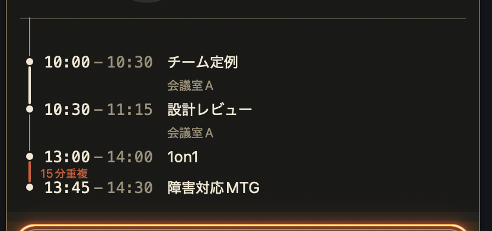

KOKUKOKU 紹介LT(5分)

<h1>見た目の型・4案</h1>

同じ2枚(2枚目「3つの困りごと」/ 6枚目「溶ける和ろうそく」)を、4つの型で作り分けました。 違うのは <b>光の質</b> と <b>動きの量</b>。案四だけ、<b>全9枚を通すための枚</b>を足してあります。

案 一

行灯 あんどん

闇に一点の灯り。<b>静</b>。 文字が主役で、動きは滲みだけ。

p.2 / p.3

案 二

金屏風 きんびょうぶ

黒地に金と朱。<b>艶</b>。 円相が描かれ、箔がきらめく。

p.4 / p.5

案 三

刻 こく

プロダクトの文法そのまま。<b>動</b>。 行が灯り、蝋燭が本当に溶ける。

p.6 / p.7

案 四

巻物 まきもの

紙に墨と朱。<b>書</b>。 横へ繰り出され、縦組みで読む。

p.8 〜 p.12

<b>全9枚を案四で通せるか</b>を確かめる枚を足しました。紙を高くし(510→600px)、繰り出しを <b>1.5秒 → 0.75秒</b>・出揃いを <b>2.6秒 → 1.4秒</b>へ。型は2変奏 ── <b>詞書が主</b>(p.8 / p.9)と<b>絵が主</b>(p.11 / p.12)。難所の3枚が p.10 表紙(題箋だけ)・p.11 予定は「間隔」で見る(絵2点)・p.12 使い始め方(横書きのコマンドを貼紙で)です。

---
title: 案一 行灯 / 3つの困りごと
class: mk-a2
transition: fade
---

困 り ご と

<h1>3つの困りごと</h1>
<ul class="a-list">
<li style="--d:.75s">何にどれだけ時間を使ったか、<b>後から分からない</b></li>
<li style="--d:1.15s">次の予定まで<b>あと何分</b>か、カレンダーを開きに行く<em>予定そのものより、予定と予定の「間」が知りたい</em></li>
<li style="--d:1.55s">集中すると<b>休憩を忘れる</b>。気づいたら疲れている</li>
</ul>

どれも「いま何をするか」の材料。ひとつのパネルで済ませたかった

案一 行灯

---
title: 案一 行灯 / 溶ける和ろうそく
class: mk-a3
transition: fade
---

連 続 作 業 時 間

<h1>溶ける和ろうそく</h1>
<ul class="a-list">
<li style="--d:.85s">溜まるバーではなく、<b>減る蝋燭</b></li>
<li style="--d:1.25s">満ちたら休め。<b>バーは満ちると嬉しい記号</b>で、逆さまだった</li>
<li style="--d:1.65s">数字は出さない。<b>そろそろか否か</b>しか語らない</li>
</ul>

動画C約10秒

早回し

パネル下部・和ろうそくの拡大

案一 行灯

---
title: 案二 金屏風 / 3つの困りごと
class: mk-b4
transition: fade-out
---

<svg class="b-enso" viewBox="0 0 200 200" aria-hidden="true">
<defs>
<linearGradient id="ensoA" x1="0" y1="0" x2="1" y2="1">
<stop offset="0" stop-color="#8E7134"/><stop offset="0.45" stop-color="#E8D28F"/><stop offset="1" stop-color="#6B551F"/>
</linearGradient>
</defs>
<path d="M143 34 A 82 82 0 1 0 168 118 A 82 82 0 0 1 128 168" pathLength="100"/>
</svg>

困 り ご と

<h1 class="b-title">3つの困りごと</h1>
<ol class="b-list">
<li style="--d:.75s"><i>一</i>何にどれだけ時間を使ったか、<b>後から分からない</b></li>
<li style="--d:1.05s"><i>二</i>次の予定まで<b>あと何分</b>か、カレンダーを開きに行く<em>予定そのものより、予定と予定の「間」が知りたい</em></li>
<li style="--d:1.35s"><i>三</i>集中すると<b>休憩を忘れる</b>。気づいたら疲れている</li>
</ol>

どれも「いま何をするか」の材料。ひとつのパネルで済ませたかった

案二 金屏風

---
title: 案二 金屏風 / 溶ける和ろうそく
class: mk-b5
transition: fade-out
---

連 続 作 業 時 間

<h1 class="b-title">溶ける和ろうそく</h1>
<ol class="b-list">
<li style="--d:.85s"><i>一</i>溜まるバーではなく、<b>減る蝋燭</b></li>
<li style="--d:1.15s"><i>二</i>満ちたら休め。<b>バーは満ちると嬉しい記号</b>で、逆さまだった</li>
<li style="--d:1.45s"><i>三</i>数字は出さない。<b>そろそろか否か</b>しか語らない</li>
</ol>

<video class="b-video" autoplay muted loop playsinline>
<source src="./public/media/demo-c-candle-burnout.mp4" type="video/mp4" />
</video>

早回し

動画C ― 燃え尽きて、また灯るまで

案二 金屏風

---
title: 案三 刻 / 3つの困りごと
class: mk-c6
transition: slide-up
---

<h1>3つの困りごと</h1>
1 / 2 / 3

1何にどれだけ時間を使ったか、<b>後から分からない</b>

2次の予定まで<b>あと何分</b>か、カレンダーを開きに行く<em>予定そのものより、予定と予定の「間」が知りたい</em>

3集中すると<b>休憩を忘れる</b>。気づいたら疲れている

どれも「いま何をするか」の材料。<b>ひとつのパネルで済ませたかった</b>

案三 刻

---
title: 案三 刻 / 溶ける和ろうそく
class: mk-c7
transition: slide-up
---

<h1>溶ける和ろうそく</h1>
連 続 作 業 時 間

<svg viewBox="0 0 96 100" class="c-svg" aria-hidden="true">
<defs>
<linearGradient id="c7wax" x1="0" y1="0" x2="1" y2="0">
<stop offset="0" stop-color="#C7B89E"/><stop offset="0.32" stop-color="#F2E8D4"/><stop offset="1" stop-color="#C7B89E"/>
</linearGradient>
</defs>
<g class="c-smoke">
<path d="M48 26 q-4 -7 0 -14 q4 -7 0 -14 q-4 -7 0 -12" stroke="#A9A38A" stroke-width="2.4" fill="none" stroke-linecap="round"/>
</g>
<path class="c-wick" d="M48 24 L48 34" stroke="#4A3B29" stroke-width="3.4" stroke-linecap="round"/>
<path class="c-wax" d="M33 30 L63 30 C 61.5 48.36, 58.5 58.08, 58.5 63.48 C 58.5 77.52, 61 83, 61 84 L35 84 C 35 83, 37.5 77.52, 37.5 63.48 C 37.5 58.08, 34.5 48.36, 33 30 Z" fill="url(#c7wax)"/>
<ellipse class="c-cap" cx="48" cy="31" rx="13" ry="2.6" fill="#C7B89E" opacity="0.9"/>
<g class="c-flamewrap">
<g class="c-flame">
<path d="M48 24 C40.5 21.5, 37.5 13.5, 42 6.5 C44.5 2.5, 48 -0.5, 48 -4 C48 -0.5, 51.5 2.5, 54 6.5 C58.5 13.5, 55.5 21.5, 48 24 Z" fill="#FFC75C" opacity="0.38"/>
<path d="M48 24 C42 22, 39.5 15, 43 9 C45 5.5, 48 3, 48 0 C48 3, 51 5.5, 53 9 C56.5 15, 54 22, 48 24 Z" fill="#FFC75C"/>
<path d="M48 24 C45.5 22.5, 44.5 18, 46 14 C47 11.5, 48 10, 48 8 C48 10, 49 11.5, 50 14 C51.5 18, 50.5 22.5, 48 24 Z" fill="#FFF5D9" opacity="0.9"/>
</g>
</g>
<path d="M30 84 q18 -9 36 0 z" fill="#C7B89E"/>
<path d="M26 86 h44" stroke="#AB8A55" stroke-width="5" stroke-linecap="round"/>
</svg>

コードで描いたSVG

動画C約10秒

早回し

溜まるバーではなく、<b>減る蝋燭</b>

満ちたら休め。バーは<b>満ちると嬉しい記号</b>で、逆さまだった

燃え尽きたら煙。休憩キーで<b>新しい蝋燭がせり上がる</b>

案三 刻

---
title: 案四 巻物 / 三つの困りごと(詞書が主)
class: mk-scroll mk-d8
transition: fade-out
---

困 り ご と

<h1>三つの困りごと</h1>

一何に時間を使ったか分からない

二次の予定まで、あと何分か<em>知りたいのは予定と予定の「間」</em>

三集中すると休憩を忘れる

いま何をするかの材料。ひとつのパネルに

<svg class="d-clock" viewBox="0 0 240 240" aria-hidden="true">
<circle class="d-ring" cx="120" cy="120" r="104" pathLength="100"/>
<circle class="d-ring2" cx="120" cy="120" r="86"/>
<g class="d-tick">
<line x1="120" y1="26" x2="120" y2="40"/>
<line x1="120" y1="26" x2="120" y2="40" transform="rotate(30 120 120)"/>
<line x1="120" y1="26" x2="120" y2="40" transform="rotate(60 120 120)"/>
<line x1="120" y1="26" x2="120" y2="40" transform="rotate(90 120 120)"/>
<line x1="120" y1="26" x2="120" y2="40" transform="rotate(120 120 120)"/>
<line x1="120" y1="26" x2="120" y2="40" transform="rotate(150 120 120)"/>
<line x1="120" y1="26" x2="120" y2="40" transform="rotate(180 120 120)"/>
<line x1="120" y1="26" x2="120" y2="40" transform="rotate(210 120 120)"/>
<line x1="120" y1="26" x2="120" y2="40" transform="rotate(240 120 120)"/>
<line x1="120" y1="26" x2="120" y2="40" transform="rotate(270 120 120)"/>
<line x1="120" y1="26" x2="120" y2="40" transform="rotate(300 120 120)"/>
<line x1="120" y1="26" x2="120" y2="40" transform="rotate(330 120 120)"/>
</g>
<g class="d-hands">
<line class="d-hand-h" x1="120" y1="120" x2="120" y2="66"/>
<line class="d-hand-m" x1="120" y1="120" x2="120" y2="44"/>
<circle class="d-pivot" cx="120" cy="120" r="4.5"/>
</g>
</svg>

案四 巻物

---
title: 案四 巻物 / 溶ける和ろうそく(詞書が主)
class: mk-scroll mk-d9
transition: fade-out
---

和 ろ う そ く

<h1>溶ける和ろうそく</h1>

一溜まるバーではなく、減る蝋燭

二満ちたら休め。バーは逆だった

三数字は出さない<em>そろそろか否かだけ</em>

<video autoplay muted loop playsinline>
<source src="./public/media/demo-c-candle-burnout.mp4" type="video/mp4" />
</video>

早回し

図 ― 燃え尽きて、また灯るまで

案四 巻物

---
title: 案四 巻物 / 表紙(題箋だけ)
class: mk-scroll mk-d10
transition: fade-out
---

刻々
KOKUKOKU
刻一刻と時を見守る

macOS 用・自作の常駐パネル

刻々

案四 巻物 ― 表紙

---
title: 案四 巻物 / 予定は「間隔」で見る(絵が主)
class: mk-scroll mk-d11
transition: fade-out
---

間 隔

<h1>予定は「間隔」で見る</h1>

知りたいのは予定と予定の「間」

図一 ― 空き・連続・重複を色で

<video autoplay muted loop playsinline>
<source src="./public/media/demo-b-calendar-notification.mp4" type="video/mp4" />
</video>

図二 ― 触らずに立ち上がる。フォーカスは奪わない

案四 巻物 ― 絵が主

---
title: 案四 巻物 / 使い始め方(貼紙)
class: mk-scroll mk-d12
transition: fade-out
---

使 い 始 め 方

<h1>使い始め方</h1>

一入れて、開くだけ<em>Homebrew の cask</em>

二設定は TOML 一枚<em>触らなくても動く</em>

<pre class="d-cmd">$brew install --cask tadashi-aikawa/tap/kokukoku</pre>
<pre class="d-cmd">$open -a KOKUKOKU</pre>

~/.config/kokukoku/config.toml

貼紙 ― 端末に二行、設定に一枚

案四 巻物 ― 貼紙

