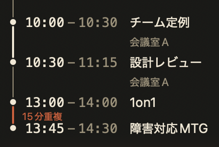

刻刻
KOKUKOKU
刻一刻と時を見守る

macOS 用・自作の常駐パネル

---
title: 三つの困りごと
class: mk-scroll kokukoku-problems
---

困 り ご と

<h1>三つの困りごと</h1>

一何に時間を使ったか分からない

二次の予定まで、あと何分か<em>知りたいのは予定と予定の「間」</em>

三集中すると休憩を忘れる

三つとも判断の材料。ひとつのパネルに

<svg class="d-clock" viewBox="0 0 240 240" aria-hidden="true">
<circle class="d-ring" cx="120" cy="120" r="104" pathLength="100"/>
<circle class="d-ring2" cx="120" cy="120" r="86"/>
<g class="d-tick">
<line x1="120" y1="26" x2="120" y2="40"/>
<line x1="120" y1="26" x2="120" y2="40" transform="rotate(30 120 120)"/>
<line x1="120" y1="26" x2="120" y2="40" transform="rotate(60 120 120)"/>
<line x1="120" y1="26" x2="120" y2="40" transform="rotate(90 120 120)"/>
<line x1="120" y1="26" x2="120" y2="40" transform="rotate(120 120 120)"/>
<line x1="120" y1="26" x2="120" y2="40" transform="rotate(150 120 120)"/>
<line x1="120" y1="26" x2="120" y2="40" transform="rotate(180 120 120)"/>
<line x1="120" y1="26" x2="120" y2="40" transform="rotate(210 120 120)"/>
<line x1="120" y1="26" x2="120" y2="40" transform="rotate(240 120 120)"/>
<line x1="120" y1="26" x2="120" y2="40" transform="rotate(270 120 120)"/>
<line x1="120" y1="26" x2="120" y2="40" transform="rotate(300 120 120)"/>
<line x1="120" y1="26" x2="120" y2="40" transform="rotate(330 120 120)"/>
</g>
<g class="d-hands">
<line class="d-hand-h" x1="120" y1="120" x2="120" y2="66"/>
<line class="d-hand-m" x1="120" y1="120" x2="120" y2="44"/>
<circle class="d-pivot" cx="120" cy="120" r="4.5"/>
</g>
</svg>

2 / 9

---
title: 呼び出して、計測する
class: mk-scroll kokukoku-demo
---

計 測

<h1>呼び出して、計測する</h1>

一ホットキーで画面中央へ

二数字キーで計測、qで消す

<SlidevVideo autoplay="once" autoreset="slide" muted playsinline>
<source src="./public/media/demo-a-invoke-and-track-tight.mp4" type="video/mp4" />
</SlidevVideo>

図一 ― マウスに触れず、数秒で計測

3 / 9

---
title: パネルの中身
class: mk-scroll kokukoku-anatomy
---

一 枚 の 中

<h1>パネルの中身</h1>

一上から、計測・予定・和ろうそく

二結果と予定は、日報へそのままコピー

図一 ― 計測・今日の予定・連続作業を一枚に

4 / 9

---
title: 予定は「間隔」で見る
class: mk-scroll kokukoku-intervals
---

間 隔

<h1>予定は「間隔」で見る</h1>

知りたいのは、予定と予定の「間」

図一 ― 空き・連続・重複を色で

<SlidevVideo autoplay="once" autoreset="slide" muted playsinline>
<source src="./public/media/demo-b-calendar-notification-tight.mp4" type="video/mp4" />
</SlidevVideo>

図二 ― 触らず通知。フォーカスは奪わない

5 / 9

---
title: 溶ける和ろうそく
class: mk-scroll kokukoku-candle
---

連 続 作 業

<h1>溶ける和ろうそく</h1>

一溜まるバーではなく、減る蝋燭

二数字は出さない<em>「そろそろ」だけを伝える</em>

<SlidevVideo autoplay="once" autoreset="slide" muted playsinline>
<source src="./public/media/demo-c-candle-burnout.mp4" type="video/mp4" />
</SlidevVideo>

図一 ― 燃え尽きたら煙。休憩で、新しい一本

6 / 9

---
title: 和の意匠は全部、機能
class: mk-scroll kokukoku-motifs
---

意 匠 と 機 能

<h1>和の意匠は全部、機能</h1>

意味と形が一致するから、覚えなくていい

<b>和ろうそく</b>連続作業の残り

<b>玉簪</b>パネルを固定

<b>そろばん</b>計測をご破算

<b>和紙の丸窓</b>いまの時刻

図一 ― パネルの和の意匠は、すべてコードで描いたSVG

7 / 9

---
title: 使い始め方
class: mk-scroll kokukoku-install
---

使 い 始 め 方

<h1>使い始め方</h1>

一一行で入れる

二設定は一枚だけ

<pre class="d-cmd">$brew install --cask tadashi-aikawa/tap/kokukoku</pre>

設定

~/.config/kokukoku/config.toml

貼紙 ― Homebrew の一行と、TOML 一枚

8 / 9

---
title: 刻一刻と時を見守る
layout: cover
class: mk-scroll kokukoku-closing
---

刻一刻と時を見守る

KOKUKOKU・刻刻

github.com/tadashi-aikawa/kokukoku

