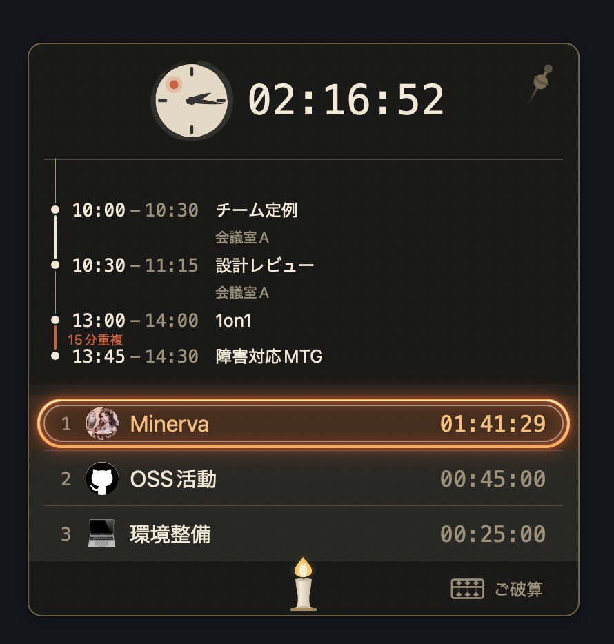
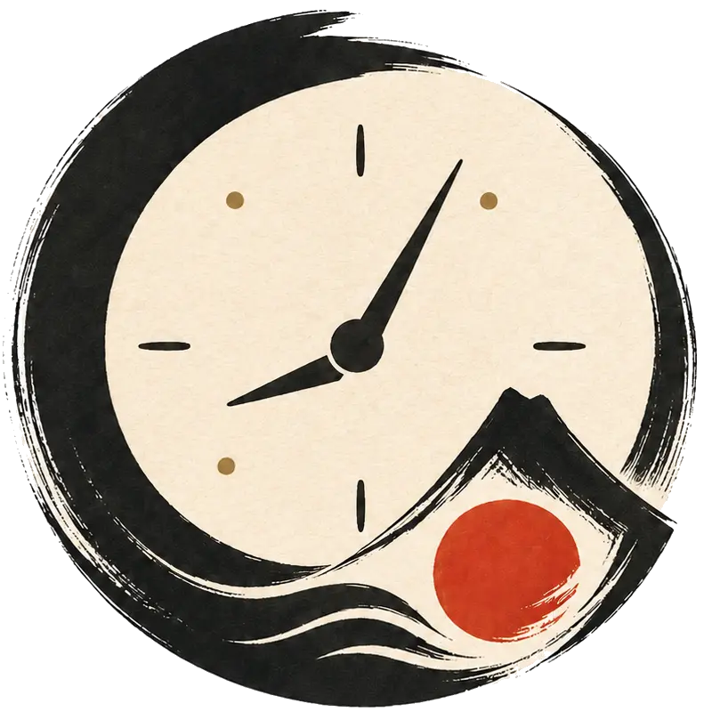

  
刻刻

  
KOKUKOKU

---
title: 気にする3つの時間
class: mk-scroll kk-scroll kk-unroll kk-three-times
---

  <h1 class="kk-title">気にする3つの時間</h1>
  

    
<strong>過去</strong>記録

    
<strong>今</strong>現在時刻

    
<strong>未来</strong>予定

  

  
3つを1つで扱うものは、案外ない

2 / 11

---
title: 3つの時間が1つのUIで動く
class: mk-scroll kk-scroll kk-sync
---

  <h1 class="kk-title">3つの時間が、1つのUIで動く</h1>
  <TimeTriad />

3 / 11

---
title: 呼び出して計測
class: mk-scroll kk-scroll kk-video-slide kk-video-a
---

  

    

      <ClickToLoopVideo src="/media/demo-a-invoke-and-track-tight.mp4" :preview-time="0.2" hide-until-click />
    

    

      
ホットキーで呼び出す

      
数字キーで計測

      
qで閉じる

    

  

4 / 11

---
title: KOKUKOKUのパネル解剖
class: mk-scroll kk-scroll kk-anatomy
---

  

    
    
現在時刻

    
予定

    
計測

    
連続作業

  

5 / 11

---
title: 予定通知
class: mk-scroll kk-scroll kk-video-slide kk-video-b
---

  <h1 class="kk-title">予定が近づくと</h1>
  

    <ClickToLoopVideo src="/media/demo-b-calendar-notification-tight.mp4" />
  

  
<strong>前面でリマンドしてくれる</strong>フォーカスは奪わない

6 / 11

---
title: 集中のライフ
class: mk-scroll kk-scroll kk-candle-life
---

  

    

      <ClickToLoopVideo src="/media/demo-c-candle-burnout.mp4" />
    

    

      
ろうそくは集中のライフ

      
尽きたら休憩のサイン

    

  

7 / 11

---
title: 世界観と遊び心
class: mk-scroll kk-scroll kk-playful
---

  <h1 class="kk-title">世界観を大切に、遊び心のあるUIを</h1>
  

    
丸窓

    
玉簪

    
和ろうそく

    
そろばん

  

8 / 11

---
title: 押しピンを簪にするまでの18弾
class: mk-scroll kk-scroll kk-kanzashi-story
---

  

    <a class="kk-article-card" href="https://minerva.mamansoft.net/Notes/%F0%9F%93%B0%E6%8A%BC%E3%81%97%E3%83%94%E3%83%B3%E3%82%92%E7%B0%AA%E3%81%AB%E3%81%99%E3%82%8B%E3%81%BE%E3%81%A7%E3%81%AE18%E5%BC%BE">
      
      

        開発記録
        <strong>押しピンを簪にするまでの18弾</strong>
        <small>minerva.mamansoft.net</small>
      

    </a>
    <ArticleScroll src="./public/media/kanzashi-article-full.png" alt="記事本文の全文キャプチャ" />
  

9 / 11

---
title: インストール
class: kk-lacquer kk-install
---

$ brew install --cask tadashi-aikawa/tap/kokukoku

10 / 11

---
title: 刻一刻と時を見守る
layout: cover
class: mk-scroll kk-scroll kk-closing
---

  
刻一刻と時を見守る

  
KOKUKOKU・刻刻

  
github.com/tadashi-aikawa/kokukoku

  

